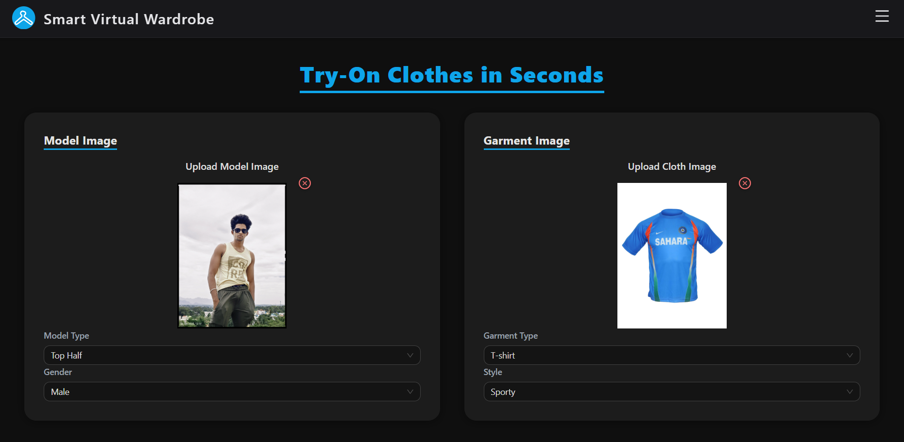
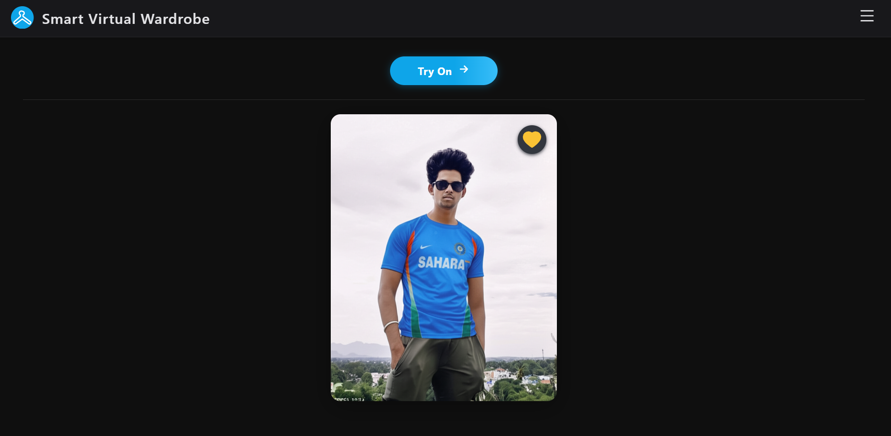

# 🧥🧥 Smart Virtual Wardrobe


A comprehensive AI-powered virtual wardrobe application that combines intelligent clothing classification, virtual try-on capabilities, personal wardrobe management, outfit advice, and 3D avatar generation. Built with a FastAPI backend and React frontend, featuring Google Gemini AI for realistic virtual try-ons, Roboflow for automatic clothing classification, OpenRouter LLM for outfit advice, and Pollinations AI for image and avatar generation.

🔗 **Related Documentations**: [Frontend README](./frontend/README.md) | [Backend README](./backend/README.md) 

**📽️ Project Demo**: [View Smart Virtual Wardrobe Demo](https://jmp.sh/iMeyrOOx)

---

# 🏆 Conference Publication & Certification

We proudly presented this research work at, "**2025 IEEE 7th International Conference on Computing, Communication and Automation 
(ICCCA)**" held on November 28-30, 2025, at Galgotias University, Greater Noida, India through **Hybrid Mode**

Paper-ID with title: **1338 - Smart Virtual Wardrobe: AI-Powered Outfit Planner and Style Assistant**

- **📄 View IEEE Conference Paper**: 👉 [Click to Open the Research Paper (PDF)](./reports/ieee-paper-1338.pdf)

- **🏅 View Presentation Certificate**: 👉 [Click to Open Presentation Certificate (PDF)](./reports/presented-certificate-1338.pdf)

- **📜 View Full Project Report**: 👉 [Click to Open Full Project Report (PHASE-1) (PDF)](./reports/project-report(phase-1).pdf)

- **🌐 IEEE Xplore Publication Link**: 👉 [Click to Open Paper's DOI Link](https://doi.org/10.1109/ICCCA66364.2025.11325354)

---

## 🚀 Core Features

- **🤖 AI Virtual Try-On**: Upload person and clothing images to generate photorealistic try-on results via Gradio (Kolors Virtual Try-On)
- **👤 Profile Management**: Users can update their profile and upload a profile photo stored on Cloudinary
- **📸 Smart Clothing Classification**: Automatic categorization of clothing items using Roboflow AI
- **👕 Personal Wardrobe Management**: Digitally organize, search, and manage your clothing collection
- **🧠 LLM Outfit Advisor**: Upload clothing images and get AI-powered outfit suggestions via OpenRouter
- **🎨 Style Feed & Apparel Catalog**: Browse/explore and save AI-generated style cards by filtering through an apparel product catalog (gender, season, color, article type, etc.)
- **🤖 Avatar Generator**: Generate a 3D model/video (MP4 preview + interactive GLB viewer) from a clothing image using the TRELLIS Gradio space
- **🔐 Secure Authentication**: JWT-based user authentication system
- **☁️ Cloud Storage**: Images stored securely on Cloudinary CDN
- **📱 Responsive Design**: Works seamlessly on desktop and mobile devices
- **🌓 Dark/Light Mode**: Toggle between themes for comfortable viewing

---

## 📸 Screenshots

Below are some screenshots showcasing the **Smart-Virtual-Wardrobe** core features:






---

## 🛠️ Tech Stack

- **Frontend:**  React.js, Ant Design, React Router, React Context API, Axios, Three.js (GLB viewer)
- **Backend:**  FastAPI, Python 3.12+, Uvicorn, Pydantic, JWT Authentication, Gradio Client
- **AI Services:**  Gradio / Kolors Virtual Try-On, Roboflow Classification, OpenRouter LLM, Pollinations Image & Avatar Generation, TRELLIS 3D Generation
- **Cloud Services:**  Cloudinary (Image Storage & CDN)
- **Database:**  MongoDB Atlas (async via Motor)

---

## ⚙️ Setup Instructions

### Prerequisites
- Python 3.12+
- Node.js 18+
- MongoDB Atlas account
- Cloudinary account
- Roboflow API key
- OpenRouter API key
- Pollinations API key (optional)
- HuggingFace token (optional, for TRELLIS 3D generation)

### 1. Clone the Repository

```bash
git clone https://github.com/Preveen369/Smart-Virtual-Wardrobe.git
cd Smart-Virtual-Wardrobe
```

### 2. Backend Setup

```bash
cd backend

# Create virtual environment
python -m venv venv
source venv/bin/activate  # On Windows: venv\Scripts\activate

# Install dependencies
pip install -r requirements.txt
# OR using Poetry
poetry install
poetry shell

# Set up environment variables
cp .env.example .env
# Edit .env with your API keys
```

### 🔧 Environment Variables
```bash
ROBOFLOW_API_KEY=your_roboflow_api_key_here
CLOUDINARY_CLOUD_NAME=your_cloudinary_name
CLOUDINARY_API_KEY=your_cloudinary_key
CLOUDINARY_API_SECRET=your_cloudinary_secret
MONGODB_URI=your_mongodb_atlas_connection_string
JWT_SECRET=your_jwt_secret_key

# OpenRouter (LLM Outfit Advisor)
OPENROUTER_API_KEY=your_openrouter_api_key
OPENROUTER_BASE_URL=https://openrouter.ai/api/v1   # optional, default shown
OPENROUTER_MODEL=nvidia/nemotron-nano-12b-v2-vl:free  # optional, default shown
OPENROUTER_FALLBACK_MODEL=gpt-4o-mini                 # optional, default shown

# Gradio Virtual Try-On space URL (optional, default shown)
GRADIO_TRYON_URL=https://ai-modelscope-kolors-virtual-try-on.ms.fun/

# Pollinations image/avatar generation (optional)
POLLINATIONS_API_KEY=your_pollinations_api_key_here

# HuggingFace token for TRELLIS 3D space (optional)
HF_TOKEN=your_huggingface_token_here
```

**Start the backend server:**
```bash
uvicorn main:app --reload    # port: 8000
```

### 3. Frontend Setup

```bash
cd frontend

# Install dependencies
npm install
```

**Start the frontend development server:**
```bash
npm run dev    # port: 5173
```


---

## 📦 API Endpoints

### Authentication & Profile
```
POST   /register                    # User registration
POST   /login                       # User login
GET    /me                          # Get current user info
GET    /profile                     # Get user profile
POST   /profile                     # Create user profile
PUT    /profile                     # Update user profile
POST   /profile/photo               # Upload profile photo
```

### Virtual Try-On
```
POST   /api/try-on                        # Generate virtual try-on
GET    /api/try-on/sessions               # Get user's try-on history
```

### Wardrobe Management
```
POST   /api/wardrobe/classify       # Classify clothing image (Roboflow)
POST   /api/wardrobe/items          # Add new wardrobe item
GET    /api/wardrobe/items          # Get user's wardrobe items
GET    /api/wardrobe/items/{id}     # Get specific item
DELETE /api/wardrobe/items/{id}     # Delete item
```

### Outfit Advisor
```
POST   /api/outfit-advisor/analyze  # Analyze outfit and get AI advice
POST   /api/outfit-advisor/upload   # Upload image for advisor
GET    /api/outfit-advisor          # List user's outfit advice history
GET    /api/outfit-advisor/{id}     # Get specific advice record
DELETE /api/outfit-advisor/{id}     # Delete advice record
```

### Favorites, Style Feed & Apparel
```
GET    /api/favorites               # List favorites (optional ?type= filter)
POST   /api/favorites               # Save a favorite
DELETE /api/favorites/{id}          # Remove a favorite
GET    /api/stylefeed               # List style-feed cards (latest first)
GET    /api/apparel/filters         # Get available filter options
GET    /api/apparel/products        # Get filtered apparel products
```

### Image & Avatar Generation

The image-generation endpoint now lives under the `style_feed` router (see `routers/style_feed.py`), while avatars remain in `routers/avatar.py`.

```
GET    /api/image/{prompt}          # Generate image via Pollinations
POST   /api/avatar                  # Generate 3D-style avatar via Pollinations
```

### 3D Model Generation
```
POST   /generate-3d                 # Generate 3D model + GLB from image (TRELLIS)
```

---

## 📁 Project Structure

```
Smart-Virtual-Wardrobe/
├── backend/
│   ├── main.py                    # FastAPI application entry point
│   ├── database.py                # MongoDB connection (Motor async)
│   ├── cloudinary_config.py       # Cloudinary folder configuration
│   ├── routers/
│   │   ├── auth.py                # Authentication & profile endpoints
│   │   ├── avatar.py                # Avatar generation endpoints 
│   │   ├── tryon.py               # Virtual try-on endpoints
│   │   ├── wardrobe.py            # Wardrobe management endpoints
│   │   ├── outfit_advisor.py      # LLM outfit advice endpoints
│   │   ├── favorites.py           # Favorites endpoints
│   │   ├── style_feed.py          # Style feed & image generation endpoints
│   │   ├── apparel.py             # Apparel catalog endpoints
│   │   └── model3d.py             # 3D model generation endpoints
│   ├── models/
│   │   ├── schemas.py             # Pydantic models / schemas
│   │   └── database_ops.py        # Database CRUD operations
│   ├── utils/
│   │   ├── base64_helpers.py      # Image encoding utilities
│   │   └── apparel_only.csv       # Apparel catalog dataset
│   ├── model_training_books/      # ML model training notebooks
│   ├── avatars_3D/                # Generated 3D assets (mp4 + glb)
│   ├── requirements.txt           # Python dependencies
│   └── pyproject.toml             # Poetry configuration
├── frontend/
│   ├── src/
│   │   ├── App.jsx                # Main application component & routing
│   │   ├── context/
│   │   │   └── AuthContext.jsx    # Authentication context provider
│   │   ├── components/
│   │   │   ├── Footer.jsx         # Footer component
│   │   │   ├── GLBViewer.jsx      # Interactive 3D GLB viewer (Three.js)
│   │   │   ├── ImageUpload.jsx    # Image upload component
│   │   │   └── Logout.jsx         # Logout button component
│   │   ├── pages/
│   │   │   ├── HomePage.jsx
│   │   │   ├── TryOnPage.jsx
│   │   │   ├── WardrobePage.jsx
│   │   │   ├── FavoritesPage.jsx
│   │   │   ├── HistoryPage.jsx
│   │   │   ├── ProfilePage.jsx
│   │   │   ├── OutfitAdvisorPage.jsx
│   │   │   ├── StyleFeed.jsx
│   │   │   ├── AvatarGeneratorPage.jsx
│   │   │   ├── HelpPage.jsx
│   │   │   ├── LoginPage.jsx
│   │   │   └── RegisterPage.jsx
│   │   ├── services/
│   │   │   └── api.js             # Axios API service functions
│   │   └── assets/
│   │       └── ClothHangerIcon.jsx
│   ├── public/                    # Public static files
│   ├── package.json               # Node.js dependencies
│   └── vite.config.js             # Vite configuration
├── screenshots/                   # Application screenshots
├── reports/                       # IEEE paper, certificate, project report
└── README.md                      # Project documentation
```

For detailed documentation on each major component, see the dedicated READMEs:
- [Backend README](./backend/README.md)
- [Frontend README](./frontend/README.md)


---

## 🧪 Testing

### Backend Tests
```bash
cd backend
pytest tests/ -v
```

### Frontend Tests
```bash
cd frontend
npm test
```

### Manual Testing
1. Register a new user account
2. Upload clothing items to your wardrobe
3. Use the classification feature to auto-categorize items
4. Try the virtual try-on with person and clothing images
5. Test search and filtering functionality
6. Verify responsive design on mobile devices

---

## 🚀 Deployment

### Production Build
```bash
# Frontend production build
cd frontend
npm run build

# Backend production
cd backend
uvicorn main:app --host 0.0.0.0 --port 8000
```

### Environment-Specific Configurations
- **Development**: Local MongoDB, Cloudinary dev environment
- **Staging**: MongoDB Atlas staging, Cloudinary staging
- **Production**: MongoDB Atlas production, Cloudinary production with CDN

---

## 🔐 Security Features

- JWT token-based authentication
- Password hashing with bcrypt
- CORS configuration for frontend-backend communication
- Secure file upload validation
- Input sanitization and validation

---

## 🤝 Contributing

We welcome contributions! Please follow these steps:

1. Fork the repository
2. Create a feature branch (`git checkout -b feature/AmazingFeature`)
3. Commit your changes (`git commit -m 'Add AmazingFeature'`)
4. Push to the branch (`git push origin feature/AmazingFeature`)
5. Open a Pull Request

---

## 🗺️ Roadmap

- [✔️] **Phase 1**: Virtual try-on and Wardrobe Clothing Classification
- [✔️] **Phase 2**: Outfit recommendation and Weather-based outfit suggestions

---

## 📄 License

This project is licensed under the MIT License - see the [LICENSE](LICENSE) file for details.

---

## 🙋‍♂️ Team & Contributors

**Lead Developer**: [Preveen S](https://linkedin.com/in/preveen-s/)
**Contributor**: [Johnson J](https://www.linkedin.com/in/johnsonj04/)

---

## 💡 Acknowledgments

- Google for Gemini AI API
- Roboflow for clothing classification models
- Cloudinary for image storage and CDN
- MongoDB Atlas for database hosting
- FastAPI team for the excellent framework
- React community for UI libraries

---

## 📧 Contact
For queries or suggestions:
- 📩 Email: spreveen123@gmail.com
- 🌐 LinkedIn: https://linkedin.com/in/preveen-s/

---

## 🌟 Show Your Support
If you like this project, please consider giving it a ⭐ on GitHub!
